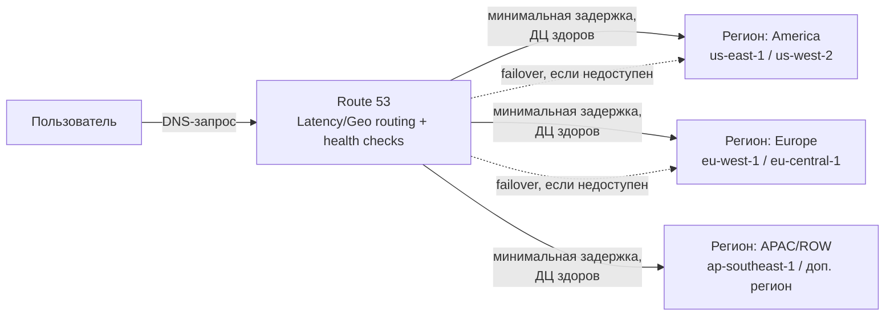
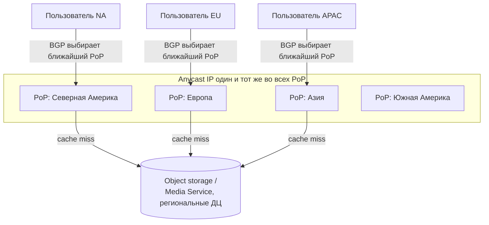

# Высоконагруженная платформа визуального поиска и сохранения идей Pinterest
### Курсовая работа по курсу «Проектирование высоконагруженных систем»

---

## 1. Тема и целевая аудитория

### Тема
Высоконагруженная платформа визуального поиска и сохранения идей (Pinterest). Ближайший аналог - Pinterest

Pinterest представляет собой визуальную поисковую платформу, которая позволяет пользователям искать, организовывать и сохранять идеи в различных тематических областях. Сервис сочетает в себе функции социальной сети, визуального поиска и системы закладок. Пользователи создают доски, на которых сохраняют пины — изображения, видео или ссылки на внешние ресурсы

### Целевая аудитория
Основная аудитория сервиса состоит из следующих групп:
- **Пользователи** - люди, которые ищут вдохновение, сохраняют идеи, создают доски и планируют различные активности;
- **Бизнес-пользователи и бренды** - компании, которые публикуют контент, продвигают продукты и взаимодействуют с аудиторией через рекламные инструменты

В качестве ориентира по масштабу используется оригинальный Pinterest. По итогам IV квартала 2025 года глобальная месячная активная аудитория (MAU) платформы достигла 619 млн пользователей (+12% г/г) [[1]](https://www.sec.gov/Archives/edgar/data/1506293/000150629326000019/q4-25xpressrelease.htm), а по итогам II квартала 2026 года — 640 млн MAU (+11% г/г),[4](https://www.sec.gov/Archives/edgar/data/0001506293/000150629326000102/q2-26xpressrelease.htm). Динамика роста аудитории приведена в разделе 2

География — глобальная. По данным за IV квартал 2025 года: США и Канада — 105 млн MAU, Европа — 158 млн MAU, остальной мир — 356 млн MAU [[1]](https://www.sec.gov/Archives/edgar/data/1506293/000150629326000019/q4-25xpressrelease.htm), (https://sproutsocial.com/insights/pinterest-statistics/)

Портрет аудитории:
- Поколение зумеров (родившиеся приблизительно после 1997 г.) стал крупнейшим поколенческим сегментом аудитории Pinterest в 2025 году, по собственному заявлению компании [8](https://www.sec.gov/Archives/edgar/data/1506293/000150629325000195/q2-25xpressrelease.htm);
- Основная часть выручки и монетизации по-прежнему приходится на аудиторию США и Канады [[1]](https://www.sec.gov/Archives/edgar/data/1506293/000150629326000019/q4-25xpressrelease.htm);

### Функционал MVP
1. Регистрация и авторизация пользователей;
2. Создание, редактирование и удаление пинов - загрузка изображений и видео с указанием описания, ссылки и тематических категорий;
3. Создание и управление досками - пользователи могут создавать доски для организации пинов по темам;
4. Сохранение пина на доску - ключевое действие, при котором пользователь добавляет чужой или свой пин в одну из своих досок;
5. Визуальный и текстовый поиск - поиск пинов по ключевым словам, категориям, а также поиск по изображению;
6. Просмотр ленты рекомендаций - персонализированная лента на основе интересов пользователя и сохранённых пинов;
7. Лайк пинов - пользователь может отметить определённый пин как понравившийся;

### Ключевые продуктовые решения
- Сервис позиционируется как визуальная поисковая платформа, а не просто социальная сеть;
- Контент организуется по принципу досок и пинов. Каждый пин содержит изображение (или видео), описание и опциональную ссылку на внешний ресурс;
- Персонализация - лента рекомендаций и результаты поиска строятся на основе сохранённых пинов, взаимодействий и поведенческих паттернов пользователя;
- Визуальный поиск - ключевое конкурентное преимущество: пользователь может найти похожие пины по загруженному изображению;
- Мобильный приоритет - значительная часть пользователей заходит через мобильные устройства, что требует адаптивного дизайна.

---

## 2. Расчёт нагрузки

### 2.1 Динамика аудитории [[1]](https://www.sec.gov/Archives/edgar/data/1506293/000150629326000019/q4-25xpressrelease.htm), [2](https://www.fool.com/earnings/call-transcripts/2026/02/12/pinterest-pins-q4-2025-earnings-call-transcript/Pinterest), [3](https://www.sec.gov/Archives/edgar/data/1506293/000150629326000060/finalars030826.htm), [4](https://www.sec.gov/Archives/edgar/data/0001506293/000150629326000102/q2-26xpressrelease.htm), [5](https://www.sec.gov/Archives/edgar/data/0001506293/000150629326000066/q1-26xpressrelease.htm):

| Квартал | MAU, млн | Рост г/г |
|---|---|---|
| Q4'24 | 553 | +11% |
| Q1'25 | 570 | +10% |
| Q2'25 | 578 | +11% |
| Q3'25 | 600 | +12% |
| Q4'25 | 619 | +12% |
| Q1'26 | 631 | +11% |
| Q2'26 | 640 | +11% |

Среднеквартальный темп роста за 10 кварталов: (640/498)^(1/10) - 1 = **2,5% за квартал**, что соответствует стабильным = 11% годовых, публикуемым компанией в каждом отчtтном квартале [1]–[4]. При проектировании системы на горизонт 2 года от точки расчёта (Q2'26, 640 млн MAU) стоит закладывать аудиторию порядка 640 * 1,11 * 1,11 = **789 млн MAU**, то есть запас по продуктовым и техническим метрикам ≈ 20–25% сверх текущих расчётных значений

Далее все расчёты выполнены от точки **MAU = 640 млн** (Q2 2026, факт [4](https://www.sec.gov/Archives/edgar/data/0001506293/000150629326000102/q2-26xpressrelease.htm)) — как от «сегодняшнего» среза, с которого имеет смысл проектировать систему

**Дневная аудитория (DAU).** Pinterest не раскрывает DAU напрямую. Единственный официально публикуемый показатель вовлечённости — доля недельной аудитории (WAU) в MAU: **WAU/MAU = 62%** по состоянию на 31.12.2025 [3](https://www.sec.gov/Archives/edgar/data/1506293/000150629326000060/finalars030826.htm). Отсюда WAU (факт, пересчитанный) = 640 * 0,62 ≈ **397 млн**.
Прямого DAU/MAU Pinterest не публикует. Для наших целей взято рабочее допущение **DAU/MAU = 25%** — середина диапазона 20-30%, характерного для сервисов с «поисковым», а не «мессенджерным» паттерном использования (по мобильной аналитике DAU/MAU = 28% только для мобильного трафика, без веба) [9](https://www.blog.udonis.co/mobile-marketing/mobile-apps/pinterest). Итог: **DAU = 160 млн** (допущение на основе стороннего ориентира, а не факт компании)

### 2.2 Продуктовые метрики 

Доля видео-пинов Pinterest публично не раскрывает - используется допущение 4% (типично для видео на визуальных платформах с преимущественно фотоконтентом)

| Метрика | Значение | 
|---|---|
| Месячная аудитория, MAU | 640 млн | 
| Недельная аудитория, WAU |  397 млн | 
| Дневная аудитория, DAU | 160 млн | 
| Всего пинов на платформе | 300 млрд | 
| Пинов на пользователя  | 468,75 шт. | 
| Изображения (+-96%) | 450 шт. - 0,225 Гб |
| Видео  | 18,75 шт. - 0,469 Гб | 
| Итого объём на пользователя |  0,69 Гб | 
| Досок на платформе | 6 млрд | 
| Досок на пользователя | 9,4 шт. | 
| Поисковых запросов, всего в месяц | 80 млрд | 
| Поисковые запросы на DAU в день | 17 | 
| Сохранений пина на доску, всего в неделю | 1,5 млрд |
| Сохранений на DAU в день | 1,3 |
| Лайков на DAU в день | 10–20 | 
| Создание пина, на DAU в день | 0,05–0,1 |
| Просмотров пина, на DAU в день | 200 |
| Создание/редактирование доски, на DAU в день | 0,005–0,01 | 
| Внешних кликов, всего в месяц | 1,7 млрд | 

### 2.3 Технические метрики

#### Размер хранения в разбивке по типам данных [11](https://aws.amazon.com/solutions/case-studies/pinterest-proserve)

| Тип данных | Кол-во | Средний размер | Общий объём |
|---|---|---|---|
| Изображения (96% пинов) | 288 млрд | 500 Кб | 288×10⁹ × 500 Кб = 144×10¹² Кб = **144 ПБ** |
| Видео (4% пинов, допущение) | 12 млрд | 25 Мб | 12×10⁹ × 25 Мб = 300×10⁶ ГБ = **300 ПБ** |
| **Итого** | 300 млрд | — | **444 ПБ** |

#### Сетевой трафик

Суточный трафик, DAU * просмотров/день * средний размер превью :

160 млн * 200 * 150 Кб = 4,8 * 10¹² Кб = **≈ 4,8 ПБ/сутки**

| Тип трафика | Объём/сутки | Доля | 
|---|---|---|
| Раздача медиаконтента (лента, поиск, просмотр пина) | ≈ 4,8 ПБ | > 99% | 
| Ответы поискового и API-слоя (текст/метаданные) | ≈ 18,7 ТБ | < 1% |
| Загрузка нового контента (создание пина) | ≈ 17,9 ТБ | < 1% | 

Пиковое потребление в течение суток:
Средний трафик = 4,8 ПБ/сутки = 4,8×10¹⁵ Б / 86 400 с = 55,6 ГБ/с = **444 Гбит/с**.
Вечерний пик (умножение на коэффициент неравномерности 2,5-2,7×, характерный для суточной кривой потребления соцсетей) - **1150–1200 Гбит/с** - используется для выбора сетевых интерфейсов на границе (edge) сети

#### RPS в разбивке по типам запросов [2](https://www.fool.com/earnings/call-transcripts/2026/02/12/pinterest-pins-q4-2025-earnings-call-transcript/Pinterest),[6](https://sproutsocial.com/insights/pinterest-statistics/)

Коэффициент «средний - пиковый» принят единым = ×3 (вечерний пик), по аналогии с исходной методичкой:

| Тип запроса | Средний RPS | Пиковый RPS | 
|---|---|---|
| Поиск (текстовый + визуальный) | 30 900 | 93 000 |
| Загрузка ленты рекомендаций (пакет ~20 пинов/запрос) | 18 500 | 55 000 | 
| Просмотр/показ пина (импрешн) | 37 0000 | 1 100 000 |
| Сохранение пина на доску | 2 500 | 7 500 |
| Лайк пина | 27 800 | 83 000 | 
| Создание пина | 140 | 420 | 
| Создание/редактирование доски | 14 | 42 | 
| Аутентификация/обновление сессии | 2 200 | 6 600 | 

---

## 3. Глобальная балансировка нагрузки

### 3.1 Функциональное разбиение по доменам

Для распределения нагрузки между дата-центрами систему сначала делят на независимо масштабируемые домены (bounded contexts), каждый со своим профилем нагрузки:

| Домен | Зона ответственности | Профиль нагрузки |
|---|---|---|
| **Identity/Auth** | регистрация, вход, сессии, токены | низкий RPS, критичен к консистентности |
| **Pin Service** | CRUD метаданных пина | низкий RPS на запись, высокий на чтение (через кэш) |
| **Board Service** | CRUD досок, состав доски | очень низкий RPS |
| **Media/Storage Service** | приём, хранение, транскодирование изображений и видео | низкий RPS запросов, но огромный объём байт |
| **Search & Visual Search Service** | текстовый и визуальный (по изображению) поиск, индекс, embedding-модели | очень высокий RPS, высокая вычислительная стоимость (ML-инференс) |
| **Feed/Recommendation Service** | ранжирование и формирование ленты | самый высокий RPS, требует локальности данных о пользователе |
| **Interaction/Graph Service** | лайки, сохранения, подписки, граф интересов | средний RPS на запись |
| **Ads/Monetization** | реклама (вне MVP, но существует в реальной системе) | отдельный домен, не смешивается с органическим трафиком |

### 3.2 Обоснование расположения дата-центров

Реальный Pinterest не владеет собственными дата-центрами: с 2010 года компания строит инфраструктуру на AWS, а с 2017 года AWS закреплён как основной облачный провайдер по долгосрочному соглашению (в 2026 году соглашение расширено до совокупных обязательств в размере 4 млрд USD на облачные сервисы и AI-инфраструктуру до 2031 года) [12](ttps://w.media/pinterest-and-aws-sign-us-4-billion-dollar-cloud-service-deal-for-ai-expansion/), [13](https://www.sec.gov/Archives/edgar/data/1506293/000150629320000013/pins-20191231.htm). Раздача статического контента (изображения/видео) при этом идёт через несколько независимых CDN — по данным анализа доменной инфраструктуры Pinterest используются одновременно Akamai, Amazon CloudFront/AWS, Fastly и Cloudflare [14](https://www.netify.ai/resources/applications/pinterest)

Из этого вытекает практическая модель размещения:
- **Региональные AWS-регионы (compute + горячее хранилище + БД)** - размещаются там, где сосредоточена аудитория, чтобы минимизировать RTT для интерактивных сценариев (лента, поиск, лайк/сохранение - операции, чувствительные к задержке):
 - **Северная Америка** - основной регион (US&Canada = 105 млн MAU, 17% аудитории, но исторически highest ARPU и основной центр разработки [[1]](https://www.sec.gov/Archives/edgar/data/1506293/000150629326000019/q4-25xpressrelease.htm));
 - **Европа** - второй по значимости регион (158 млн MAU, 25,5% аудитории [[1]](https://www.sec.gov/Archives/edgar/data/1506293/000150629326000019/q4-25xpressrelease.htm));
 - **Остальной мир / Азия** - регион с наибольшей и наиболее быстрорастущей аудиторией (356 млн MAU, 57,5% аудитории [[1]](https://www.sec.gov/Archives/edgar/data/1506293/000150629326000019/q4-25xpressrelease.htm)), важен для будущего масштабирования, хотя монетизация здесь пока ниже;
- **Холодное хранилище пинов/видео** (объект-сторедж, наименее чувствителен к задержке) может быть централизован в 1–2 макрорегионах с репликацией, так как обращение к «хвосту» из 300 млрд пинов происходит редко;
- **CDN edge PoP (anycast)** - разворачивается гранулярно, вне зависимости от размещения основных ДЦ, максимально близко к пользователю в сотнях точек присутствия - это и есть основной инструмент снижения задержки для статики, а не размещение самих вычислительных ДЦ;

### 3.3 Распределение запросов по типам между ДЦ

Доли аудитории по регионам взяты из факта раздела 1/3.2 (US&Canada 17%, Европа 25,5%, ROW 57,5%, на базе MAU Q4'25 = 619 млн [[1]](https://www.sec.gov/Archives/edgar/data/1506293/000150629326000019/q4-25xpressrelease.htm)) и применены к среднему RPS как первое приближение (в реальности доля по типам запроса может отличаться от доли по MAU из-за разницы во времени суток и интенсивности использования, но для распределения ёмкости ДЦ это разумная отправная точка):

| Тип запроса | Средний RPS (всего) | US&Canada (17%) | Европа (25,5%) | ROW (57,5%) |
|---|---|---|---|---|
| Поиск | 30 900 | 5 253 | 7 880 | 17 768 |
| Показ пина (импрешн) | 370 000 | 62 900 | 94 350 | 212 750 |
| Загрузка ленты | 18 500 | 3 145 | 4 718 | 10 638 |
| Сохранение пина | 2 500 | 425 | 638 | 1 438 |
| Лайк | 27 800 | 4 726 | 7 089 | 15 985 |
| Создание пина | 140 | 24 | 36 | 81 |

Вывод: даже с наименьшей долей монетизации регион ROW формирует больше половины вычислительной нагрузки - при выборе ДЦ и sizing-е важно закладывать capacity в азиатско-тихоокеанском/латиноамериканском регионе пропорционально трафику, а не выручке

### 3.4 Схема DNS-балансировки

Так как реальная инфраструктура построена на AWS, естественная схема - **latency-based / geolocation routing через Amazon Route 53**:

Принцип работы:
1. Route 53 периодически опрашивает health-check эндпоинты каждого регионального кластера;
2. При DNS-резолве клиенту возвращается IP региона с наименьшей задержкой из числа «здоровых»;
3. При деградации/отказе региона (по health-check) трафик автоматически перенаправляется в соседний регион (failover routing policy) - это же служит основой disaster recovery;

### 3.5 Схема Anycast-балансировки

Для статического и медиаконтента (изображения, видео - то есть основной объём из 444 ПБ и почти весь суточный трафик 4,8 ПБ) DNS-уровня недостаточно - используется **anycast на уровне CDN**: один и тот же IP-адрес анонсируется из множества географически распределённых точек присутствия (PoP), а сетевая маршрутизация (BGP) сама приводит пакет пользователя в ближайший по сетевой метрике PoP

В реальном Pinterest эта роль выполняется одновременно несколькими CDN-провайдерами (Akamai, Fastly, Cloudflare, AWS CloudFront), что подтверждается анализом обслуживающей инфраструктуры доменов pinterest.\* [14] - то есть на практике используется мульти-CDN-стратегия, а не единственный anycast-провайдер, что дополнительно повышает отказоустойчивость раздачи медиаконтента

### 3.6 Механизм регулировки трафика между ДЦ

Между региональными кластерами используется комбинация из трёх механизмов:
1. **Weighted routing на уровне Route 53/Global Accelerator** - плавный перевод доли трафика между регионами (например, при выкатке новой версии сервиса в регионе или при плановом увеличении его доли ёмкости), а не резкое переключение 100%-0%;
2. **Health-check + circuit breaker** - при деградации внутреннего домена (например, Search Service в одном регионе отвечает медленнее SLA) балансировщик на уровне сервис-меша перенаправляет часть или весь трафик в соседний регион, где домен реплицирован;
3. **Локальность данных с ассинхронной кросс-региональной репликацией** - для доменов Pin/Board/Interaction, где пользователь один, а обращаться к его данным может любой регион (роуминг), используется репликация «домашнего» региона пользователя в соседние с приемлемой задержкой согласованности (eventual consistency), чтобы не гонять каждый read-запрос через океан;

Эти три механизма вместе дают возможность:
- перераспределять нагрузку между ДЦ без даунтайма (weighted routing);
- переживать отказ целого региона (circuit breaker + DNS failover);
- поддерживать низкую задержку для «глобальных» пользователей (репликация + anycast для статики);

---

## Список источников

[[1]](https://www.sec.gov/Archives/edgar/data/1506293/000150629326000019/q4-25xpressrelease.htm) Pinterest, Inc. *Pinterest Announces Fourth Quarter and Full Year 2025 Results*

[[2]](https://www.fool.com/earnings/call-transcripts/2026/02/12/pinterest-pins-q4-2025-earnings-call-transcript/Pinterest) Inc. Q4 2025 Earnings Call Transcript, 12.02.2026 

[[3]](https://www.sec.gov/Archives/edgar/data/1506293/000150629326000060/finalars030826.htm) Pinterest, Inc. Form 10-K / Annual Report to Stockholders (ARS) за 2025 финансовый год 

[[4]](https://www.sec.gov/Archives/edgar/data/0001506293/000150629326000102/q2-26xpressrelease.htm) Pinterest, Inc. *Pinterest Announces Second Quarter 2026 Results* — пресс-релиз, 04.08.2026 (SEC Form 8-K): 640 млн глобальных MAU, +11% г/г. 

[[5]](https://www.sec.gov/Archives/edgar/data/0001506293/000150629326000066/q1-26xpressrelease.htm) Pinterest, Inc. *Pinterest Announces First Quarter 2026 Results* — пресс-релиз, 04.05.2026 (SEC Form 8-K): 631 млн MAU. 

[[6]](https://sproutsocial.com/insights/pinterest-statistics/) Sprout Social. *29 Essential Pinterest statistics for marketers in 2026* (со ссылкой на внутренние данные Pinterest: «users save over 1.5 billion Pins each week», MAU Q4'25 = 619 млн)

[[7]](https://medium.com/pinterest-engineering) Pinterest Engineering Blog — официальный слоган технического блога компании: «Inventive engineers building the first visual discovery engine, 300 billion ideas and counting». 

[[8]](https://www.sec.gov/Archives/edgar/data/1506293/000150629325000195/q2-25xpressrelease.htm) Pinterest, Inc. Q2 2025 Earnings press release, 07.08.2026: заявление о том, что поколение Gen Z составляет более половины аудитории

[[9]](https://www.blog.udonis.co/mobile-marketing/mobile-apps/pinterest) Udonis Blog. *Pinterest Statistics [2026]: Users, Downloads & Revenue* (сторонняя оценка на основе данных мобильной аналитики AppMagic: мобильный DAU/MAU ≈ 28%; отмечено, что это оценка только по мобильному приложению, без веб-трафика)

[[10]](https://medium.com/pinterest-engineering/sharding-pinterest-how-we-scaled-our-mysql-fleet-3f341e96ca6f) Pinterest Engineering Blog. *Sharding Pinterest: How we scaled our MySQL fleet*, 2017 г. («There are more than 50 billion Pins that have been saved by Pinners onto one billion boards»)

[[11]](https://aws.amazon.com/solutions/case-studies/pinterest-proserve) Amazon Web Services. *How Pinterest Engaged with AWS ProServe to Ensure Pinners have Always-On Access to their Platform* — официальный кейс AWS с цитатой Coburn Watson (VP, Head of Infrastructure & SRE, Pinterest) о «nearly exabyte of data»

[[12]](ttps://w.media/pinterest-and-aws-sign-us-4-billion-dollar-cloud-service-deal-for-ai-expansion/) W.Media. *Pinterest and AWS sign US$4 billion dollar cloud service deal for AI expansion*, 08.06.2026 (пресс-релиз компании, цитаты Matt Madrigal, CTO Pinterest, и Dave Brown, SVP AWS)

[[13]](https://www.sec.gov/Archives/edgar/data/1506293/000150629320000013/pins-20191231.htm) Pinterest, Inc. Form 10-K за 2019 финансовый год — исходное соглашение с AWS от мая 2017 г. (обязательство минимум $750 млн облачных услуг)

[[14]](https://www.netify.ai/resources/applications/pinterest) Netify.ai. Технический профиль инфраструктуры домена Pinterest — используемые CDN/хостинг-провайдеры (Akamai, Amazon AWS, Cloudflare, Fastly)
